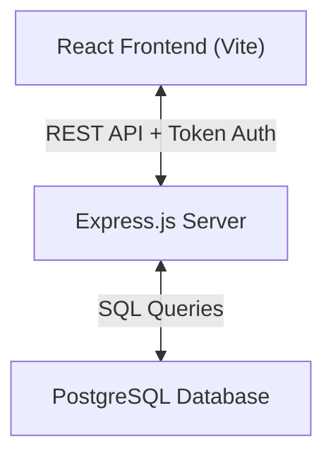
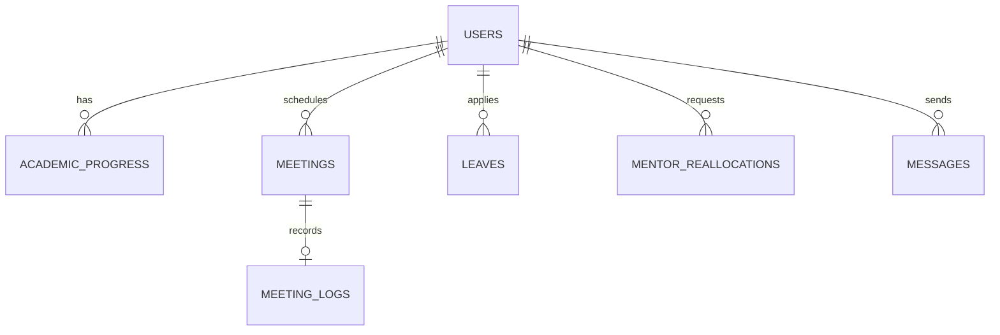

# Project Report: MentiConnect Mentorship Portal

MentiConnect is a modern, responsive web application designed to streamline academic guidance, performance tracking, and communication between **HOD/Admins**, **Mentors (Faculty)**, and **Mentees (Students)**.

---

## 1. System Architecture & Technology Stack

The platform is designed around a single-page architecture (SPA) with real-time state synchronization:

* **Frontend**: React (Vite), Lucide Icons, Vanilla CSS (Premium Glassmorphism theme, dynamic dark/light mode toggle).
* **Backend**: Node.js, Express.js, JWT Authentication.
* **Database**: PostgreSQL (relational schemas tracking users, academic progress, leave requests, meetings, logs, and chats).

---

## 2. Key Modules & Features

### 🎓 Academic Performance Hub (Admin)
- Unified panel showing overall mentorship progress grouped by Mentor.
- Calculates dynamic aggregates (Average CGPA, Average Reward Points).
- System-wide alerts for low attendance (<75%) and low CGPA (<6.5) displaying assigned mentors.

### ⚠️ Student Insights & At-Risk Board (Mentor)
- Allows faculty to instantly review assigned mentees falling under critical thresholds.
- Separated panels for:
  - **Low Attendance Risk** (<75%)
  - **Low CGPA Risk** (<6.5)
  - **Low Reward Points** (<30)

### 📅 Meeting Logs & Group Scheduler
- Mentors can schedule a single meeting for multiple students simultaneously.
- Tables consolidate group sessions into a single row to avoid duplicates, displaying all participant names.
- Upon meeting completion, mentors submit logs (Discussion Points, Action Items, Comments) reviewed by HOD/Admin.

### ✈️ Mentorship Reallocation Hub
- If a mentor goes on leave, they submit a delegation request reallocating their students to alternative mentors.
- HOD/Admin reviews, rejects, or approves delegation requests.
- When approved, automatic notification alerts are sent to the students and new mentors.

### 📄 Secure PDF Document Viewer
- Students upload marksheets and certificates.
- Frontend base64-to-Blob conversion creates secure local Object URLs (`blob:`) bypassing browser iframe sandbox navigation blocks.

---

## 3. Database Schema

The relational database is structured as follows:

1. **`users`**: Academic profiles, qualification details (`M.E., Ph.D. in CSE`), phone numbers, address, and role.
2. **`academic_progress`**: Tracks GPA, CGPA, attendance, backlogs, and reward points.
3. **`meetings`**: Scheduled mentorship sessions.
4. **`meeting_logs`**: Discussion minutes and action items submitted by mentors.
5. **`mentor_reallocations`**: Holds pending/approved delegation requests for leave.
6. **`messages`**: Real-time one-to-one chats.
7. **`notifications`**: User alert inbox.

---

## 4. UI/UX Design System
- **Premium Glassmorphism**: Utilizes soft translucent backgrounds, subtle borders, and HSL variables (`--primary`, `--accent-rose`, `--bg-surface`).
- **Responsive Grids**: Fully aligned layouts (`col-12`, `col-8`, `col-4`) ensuring clean rendering across mobile, tablet, and desktop monitors.
